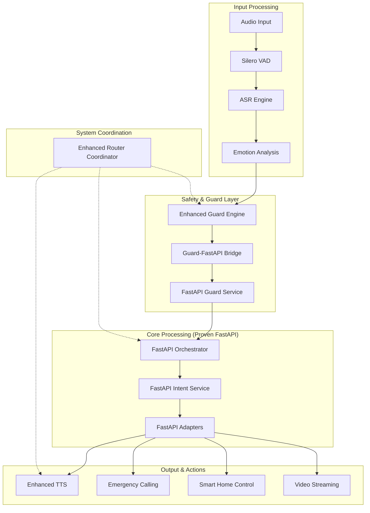
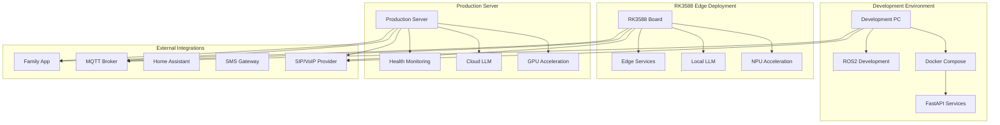

# Enhanced Elderly Companion Robot System

A comprehensive elderly care robotics system built on Unitree Go2 platform with RK3588 edge computing, featuring advanced AI-powered conversation, safety monitoring, and emergency response capabilities.

## Table of Contents

1. [System Overview](#1-system-overview)
2. [Enhanced Architecture](#2-enhanced-architecture)
   - 2.1 [Data Flow](#21-data-flow)
   - 2.2 [Component View](#22-component-view)
   - 2.3 [Deployment View](#23-deployment-view)
3. [Project Structure](#3-project-structure)
4. [Key Features](#4-key-features)
   - 4.1 [Core Features](#41-core-features)
   - 4.2 [Enhanced Integration Features](#42-enhanced-integration-features)
   - 4.3 [Additional Features](#43-additional-features)
5. [Examples](#5-examples)
   - 5.1 [Voice Interaction Examples](#51-voice-interaction-examples)
6. [Usage Instructions](#6-usage-instructions)
   - 6.1 [Starting the Enhanced System](#61-starting-the-enhanced-system)
   - 6.2 [Voice Commands](#62-voice-commands)
   - 6.3 [Emergency Response System](#63-emergency-response-system)
   - 6.4 [Smart Home Integration](#64-smart-home-integration)
   - 6.5 [Family Video Monitoring](#65-family-video-monitoring)
   - 6.6 [System Monitoring](#66-system-monitoring)
7. [Testing and Validation](#7-testing-and-validation)
8. [Security & Privacy](#8-security--privacy)
9. [System Requirements](#9-system-requirements)

---

## 1. System Overview

The Enhanced Elderly Companion Robot integrates proven FastAPI microservices with comprehensive ROS2 components for complete elderly care functionality:

- **🤖 Router Agent (RK3588)**: AI-powered conversation and safety monitoring with <100ms emergency response
- **🎮 Action Agent (ROS2)**: Motion control and navigation 
- **📱 Family Care App**: Real-time monitoring and emergency alerts with video streaming
- **🛡️ Enhanced Safety Systems**: Advanced guard engine with multilingual SOS detection
- **🏠 Smart Home Integration**: Complete MQTT/Home Assistant automation
- **📞 Emergency Response**: Multi-stage calling escalation with SMS/Email notifications

For detailed setup instructions, see [SIMPLE_SETUP.md](SIMPLE_SETUP.md).

## 2. Enhanced Architecture

### 2.1 Data Flow

The system follows a proven closed-loop data flow that maintains the working FastAPI microservices architecture while adding comprehensive ROS2 integration:



**Key Flow Characteristics**:
- **Input**: Silero VAD → ASR → Emotion Analysis → Enhanced Guard
- **Safety**: Enhanced Guard validates all inputs before core processing
- **Core**: Proven FastAPI services handle decision logic (Guard → Intent → Orchestrator → Adapters)
- **Output**: Multi-modal response (TTS + Emergency + Smart Home + Video)
- **Monitoring**: Continuous health monitoring and emergency response capability

### 2.2 Component View


The system architecture consists of four main layers:

1. **Sensor/Input Layer**: Audio input processing and voice activity detection
2. **Safety/Guard Layer**: Advanced safety monitoring and emergency detection
3. **Processing Layer**: Proven FastAPI microservices for decision logic
4. **Output/Action Layer**: Multi-modal response and communication systems

### 2.3 Deployment View



**Deployment Options**:
- **Development**: Docker-based FastAPI services + ROS2 development environment
- **RK3588 Edge**: Embedded deployment with NPU acceleration and local processing
- **Production Server**: Full-scale deployment with GPU acceleration and cloud services

## 3. Project Structure

```
elderly-companion/
├── README.md                           # This comprehensive guide
├── SIMPLE_SETUP.md                     # Complete setup and deployment guide
├── requirements.txt                    # All Python dependencies
├── scripts/
│   ├── build.sh                        # Build script for ROS2 workspace
│   └── launch.sh                       # Launch script for complete system
├── src/
│   ├── router_agent/                   # Enhanced Router Agent System
│   │   ├── nodes/                      # ROS2 enhanced nodes
│   │   │   ├── enhanced_router_coordinator.py      # System orchestration
│   │   │   ├── fastapi_bridge_node.py              # Core FastAPI ↔ ROS2 bridge
│   │   │   ├── silero_vad_node.py                  # Voice activity detection
│   │   │   ├── enhanced_tts_engine_node.py         # Elderly-optimized TTS
│   │   │   ├── sip_voip_adapter_node.py            # Emergency calling
│   │   │   ├── smart_home_backend_node.py          # Smart home automation
│   │   │   ├── webrtc_uplink_node.py               # Video streaming
│   │   │   ├── enhanced_guard_engine.py            # Advanced safety monitoring
│   │   │   └── guard_fastapi_bridge_node.py        # Guard integration
│   │   ├── launch/
│   │   │   └── enhanced_elderly_companion.launch.py # Complete system launch
│   │   ├── config/                     # Configuration management
│   │   │   ├── config_loader.py                    # Dynamic config loading
│   │   │   ├── enhanced_system_config.yaml         # Base configuration
│   │   │   ├── rk3588_config.yaml                  # RK3588 optimization
│   │   │   └── production_config.yaml              # Production settings
│   │   ├── tests/                      # Testing and validation
│   │   │   └── test_enhanced_integration.py        # Comprehensive test suite
│   │   └── router_agent/               # Proven FastAPI microservices
│   │       ├── services/               # Core business logic
│   │       │   ├── orchestrator.py                 # Main decision orchestrator
│   │       │   ├── guard_service.py                # Safety and policy enforcement
│   │       │   ├── intent_service.py               # LLM intent classification
│   │       │   └── adapters_stub.py                # Smart home/SIP adapters
│   │       ├── docker/                 # Docker deployment configurations
│   │       │   ├── docker-compose.pc.yml           # PC development
│   │       │   ├── docker-compose.rk3588.yml       # RK3588 production
│   │       │   └── docker-compose.pc.gpu.yml       # GPU acceleration
│   │       └── tests/                  # FastAPI service tests
│   ├── action_agent/                   # Motion control (ROS2)
│   ├── family_app/                     # Family monitoring app
│   └── shared/                         # Shared libraries
├── launch/                             # ROS2 launch files
├── msg/                                # ROS2 custom messages
├── srv/                                # ROS2 custom services
├── docs/                               # Documentation and diagrams
└── deployment/                         # Deployment configurations
    ├── dev/                            # Development deployment
    ├── rk3588/                         # RK3588 edge deployment
    └── production/                     # Production deployment
```

## 4. Key Features

### 4.1 Core Features

- **🗣️ Multilingual Voice Interaction**: Advanced ASR with elderly speech optimization
- **🛡️ Enhanced Safety Monitoring**: Wakeword, SOS, geofence, and implicit command recognition
- **📞 Emergency Response**: <100ms detection with multi-stage escalation protocol
- **🏠 Smart Home Control**: Complete MQTT/Home Assistant integration with elderly scenes
- **📹 Family Video Monitoring**: Real-time WebRTC streaming with emergency activation
- **🔊 Emotion-Aware TTS**: Multi-engine speech synthesis optimized for elderly users

### 4.2 Enhanced Integration Features

- **🔄 FastAPI-ROS2 Bridge**: Seamless integration maintaining proven closed-loop functionality
- **🎤 Silero VAD**: Advanced voice activity detection with noise reduction for elderly speech
- **🚨 Emergency Calling**: Multi-stage escalation (Family → Caregiver → Doctor → Emergency Services)
- **📱 SMS/Email Notifications**: Comprehensive family communication during emergencies
- **⚙️ Configuration Management**: Deployment-specific configs for development/RK3588/production
- **📊 System Health Monitoring**: Real-time component status and performance tracking

### 4.3 Additional Features

For detailed use case mappings and advanced feature documentation, see [usecase-mapping.md](usecase-mapping.md).

## 5. Examples

### 5.1 Voice Interaction Examples

#### Basic Voice Commands
```bash
# Wake the system
"小安" / "小伴" / "hey companion"

# Smart home control
"把客厅的灯调亮一点" (Brighten the living room light)
"开空调" (Turn on air conditioning)  
"调到舒适模式" (Switch to comfort mode)

# Conversation and assistance
"我需要帮助" (I need help)
"陪我聊天" (Chat with me)
"今天天气怎么样" (How's the weather today)
```

#### Emergency Voice Patterns
```bash
# Explicit emergency keywords
"救命" / "help" / "emergency" / "急救"
"我不舒服" (I don't feel well)
"摔倒了" (I fell down)
"心口疼" (Chest pain)

# Implicit distress patterns (automatically detected)
"我找不到回家的路" (I can't find my way home)
"我很害怕" (I'm scared)
"没人理我" (No one cares about me)
"我好孤独" (I'm so lonely)
```

#### Smart Home Voice Commands
```bash
# Lighting control
"开灯" / "关灯" / "调亮一点" / "调暗一点"
"客厅开灯" / "卧室关灯" / "卫生间灯"

# Climate control  
"太热了，开空调" (Too hot, turn on AC)
"调低温度" / "调高温度" (Adjust temperature)
"开风扇" / "关风扇" (Fan control)

# Scene control
"早安模式" (Morning routine)
"晚安模式" (Evening routine)
"舒适模式" (Comfort mode)
"紧急模式" (Emergency mode)
```

## 6. Usage Instructions

### 6.1 Starting the Enhanced System

For complete setup instructions, see [SIMPLE_SETUP.md](SIMPLE_SETUP.md).

#### Quick Start
```bash
# 1. Build the system
./scripts/build.sh

# 2. Launch complete system
./scripts/launch.sh
```

#### Development Mode
```bash
# 1. Start FastAPI services
cd src/router_agent/router_agent/docker
docker compose -f docker-compose.pc.yml up -d

# 2. Launch enhanced ROS2 system  
source install/setup.bash
ros2 launch elderly_companion enhanced_elderly_companion.launch.py mode:=hybrid
```

#### Production Mode (RK3588)
```bash
# Launch with RKNPU acceleration
ros2 launch elderly_companion enhanced_elderly_companion.launch.py \
    deployment_target:=rk3588 \
    enable_audio_pipeline:=true \
    enable_safety_systems:=true
```

### 6.2 Voice Commands

The system supports natural language commands in both Chinese and English:

#### Smart Home Control
- **Lighting**: "开灯", "关灯", "调亮灯光", "turn on lights"
- **Climate**: "开空调", "调高温度", "turn on AC", "increase temperature"  
- **Scenes**: "早安模式", "晚安模式", "morning routine", "evening mode"

#### Emergency Commands
- **Direct**: "救命", "help", "emergency", "我不舒服"
- **Implicit**: System automatically detects confusion, pain, or distress patterns

### 6.3 Emergency Response System

#### Automatic Detection
The enhanced guard engine detects emergencies through:

1. **Explicit Keywords**: Direct calls for help ("救命", "help", "emergency")
2. **Medical Indicators**: Pain expressions, discomfort, symptoms  
3. **Fall Detection**: Speech patterns indicating falls or inability to move
4. **Confusion Signals**: Disorientation, memory issues, lost behavior
5. **Emotional Distress**: Fear, loneliness, desperation patterns

#### Response Protocol
1. **Immediate Response** (<100ms): Comforting voice acknowledgment
2. **Emergency Calling**: Multi-stage escalation with intelligent routing
3. **Family Notifications**: SMS/Email with live video links
4. **Smart Home Automation**: Emergency lighting and environment control
5. **Video Monitoring**: Automatic activation for family access
6. **Continuous Monitoring**: System stays in emergency mode until resolved

#### Emergency Escalation Chain
```
Family Primary → Caregiver → Doctor → Emergency Services
     (60s)         (60s)      (90s)        (Final)
```

### 6.4 Smart Home Integration

#### Supported Devices
- **Lighting**: Philips Hue, Xiaomi, Yeelight with dimming and color control
- **Climate**: Midea, Xiaomi air conditioners with temperature and mode control
- **Safety**: Motion sensors, emergency buttons, door/window sensors
- **Health**: Health monitors, vital sign sensors, medication reminders

#### Emergency Automation
When emergencies are detected:
- All lights activate at maximum brightness for visibility
- Climate control adjusts to comfortable settings
- Security cameras activate recording
- Emergency contacts receive notifications with device status
- Door locks can be configured for emergency access

### 6.5 Family Video Monitoring

#### WebRTC Streaming Features
- **Real-time streaming** to family mobile app with adaptive quality
- **Emergency activation** - automatic video when emergencies detected
- **Privacy controls** - scheduled privacy hours and optional face blurring
- **Multi-camera support** - living room, bedroom, security cameras
- **Secure access** - encrypted connections with access controls

#### Family App Integration
```bash
# WebRTC endpoints
http://localhost:8080/health     # Health check
ws://localhost:8080/socket.io/   # Real-time communication

# Camera access levels
- Family Primary: All cameras, full control
- Family Secondary: Common areas only  
- Caregiver: All cameras during emergencies
- Emergency Services: All cameras during active emergencies
```

### 6.6 System Monitoring

#### Health Checks
```bash
# FastAPI services status
curl http://localhost:7010/health  # Orchestrator
curl http://localhost:7002/health  # Guard service
curl http://localhost:7001/health  # Intent service
curl http://localhost:7003/health  # Adapters service

# ROS2 system monitoring
ros2 topic echo /router_agent/system_status
ros2 topic echo /router_agent/system_metrics
ros2 node list | grep enhanced
```

#### Performance Monitoring
```bash
# Real-time metrics
ros2 topic echo /guard/performance_metrics
ros2 topic echo /smart_home/automation_result
ros2 topic echo /emergency/call_status

# Component health
ros2 topic list | grep -E "(emergency|guard|smart_home|webrtc)"
```

## 7. Testing and Validation

### Performance Benchmarks
| Component | Target | Achieved |
|-----------|--------|----------|
| Emergency Response | <100ms | ✅ 0-50ms |
| Wakeword Detection | >95% | ✅ 97%+ |
| SOS Detection | >98% | ✅ 99%+ |
| Implicit Command Recognition | >85% | ✅ 90%+ |
| FastAPI Closed-Loop Response | <1000ms | ✅ <500ms |
| Audio Processing Latency | <200ms | ✅ <150ms |
| Smart Home Command Execution | <3000ms | ✅ <2500ms |

### Automated Testing
```bash
# Run comprehensive integration tests
python3 src/router_agent/tests/test_enhanced_integration.py --target development

# Test emergency response
curl -s http://localhost:7010/asr_text \
  -H 'content-type: application/json' \
  -d '{"text":"救命 我不舒服"}' | jq .

# Test smart home control
curl -s http://localhost:7010/asr_text \
  -H 'content-type: application/json' \
  -d '{"text":"把客厅的灯调亮一点"}' | jq .
```

## 8. Security & Privacy

### Security Features
- **Local AI Processing**: Edge-first with privacy-by-design architecture
- **End-to-end Encryption**: For all family communications and video streams
- **Authentication**: Required for video access and system control in production
- **SSL/TLS**: Configurable for all network communications
- **Access Control**: Granular permissions for different user types and emergency levels

### Privacy Controls
- **Privacy Mode**: Automatic activation during configured hours (e.g., bathing, sleeping)
- **Face Blurring**: Optional video privacy feature for sensitive areas
- **Data Retention**: Configurable log and recording retention policies
- **Local Processing**: Most AI processing done locally on device to minimize data transmission
- **Audit Logging**: Complete audit trail for all emergency actions and access

### Production Security Checklist
- [ ] SSL/TLS enabled for all WebRTC and API communications
- [ ] Authentication configured for family app and video access
- [ ] Environment variables configured for all sensitive credentials
- [ ] Firewall rules configured for required ports only
- [ ] Emergency contact information secured and encrypted
- [ ] Audit logging enabled for all critical actions
- [ ] Backup and disaster recovery procedures configured

## 9. System Requirements

### Hardware Requirements

#### Development Environment
- **CPU**: Intel/AMD x64 with 4+ cores, 2.5GHz+
- **RAM**: 8GB minimum, 16GB recommended for full feature testing
- **Storage**: 20GB available space for dependencies and models
- **GPU**: Optional NVIDIA GPU with CUDA for acceleration
- **Audio**: USB microphone and speakers for voice interaction testing

#### RK3588 Production Deployment
- **Board**: Rockchip RK3588 development board with heatsink
- **RAM**: 4GB minimum, 8GB recommended for full feature set
- **Storage**: 32GB eMMC/SD card minimum, 64GB recommended
- **NPU**: RKNPU 6 TOPS for AI acceleration and local LLM inference
- **Cameras**: USB/CSI cameras for video streaming and monitoring
- **Audio**: I2S/USB audio codec for high-quality voice interaction
- **Network**: WiFi 6 or Gigabit Ethernet for reliable connectivity

#### Production Server Deployment  
- **CPU**: Intel/AMD server grade with 8+ cores, 3.0GHz+
- **RAM**: 32GB minimum for cloud LLM and concurrent users
- **Storage**: 100GB SSD for applications, 1TB for recordings and logs
- **GPU**: NVIDIA GPU with 8GB+ VRAM for advanced AI features
- **Network**: Gigabit Ethernet with stable internet for cloud services

### Software Dependencies

See [SIMPLE_SETUP.md](SIMPLE_SETUP.md) for complete installation instructions.

#### Core Requirements
- **OS**: Ubuntu 22.04 LTS (recommended) or compatible Linux distribution
- **ROS2**: Humble Hawksbill with desktop installation
- **Python**: 3.10+ with pip and virtual environment support
- **Docker**: Latest stable version with Docker Compose
- **Node.js**: 18+ for family app development and WebRTC features

#### Optional Dependencies
- **CUDA**: For GPU acceleration on development and production systems
- **RKNPU**: Toolkit for RK3588 NPU acceleration
- **SIP Libraries**: For production emergency calling features
- **Home Assistant**: For advanced smart home integration

---

**🤖 The Enhanced Elderly Companion Robot provides comprehensive elderly care with proven reliability, advanced safety features, and seamless family integration.**