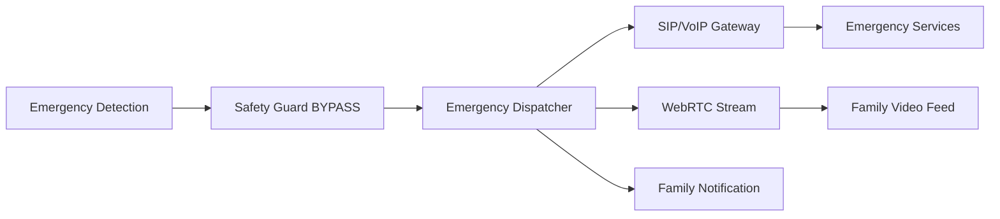
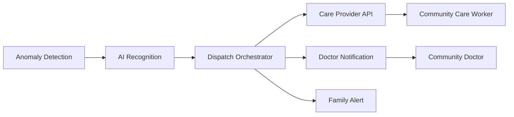

# Elderly Companion Robdog - API Specification

## Overview

This document provides comprehensive API specifications for the Elderly Companion Robdog system, including ROS2 interfaces, REST APIs, WebRTC streaming, and deployment procedures.

## System Architecture

```
┌─────────────────┐    ┌──────────────────┐    ┌────────────────┐
│   Family Care   │    │   Router Agent   │    │  Action Agent  │
│   Mobile App    │◄──►│    (RK3588)      │◄──►│    (ROS2)      │
└─────────────────┘    └──────────────────┘    └────────────────┘
                              │                         │
                              ▼                         ▼
                       ┌─────────────┐         ┌────────────────┐
                       │ Smart Home  │         │  Unitree Go2   │
                       │  Ecosystem  │         │   Platform     │
                       └─────────────┘         └────────────────┘
```

## 1. ROS2 Message Interfaces

### Core Messages

#### SpeechResult
```yaml
# File: msg/SpeechResult.msg
Header header
string text                           # Recognized speech text
float32 confidence                    # Recognition confidence (0.0-1.0)
string language                       # Detected language (zh-CN, en-US)
EmotionData emotion                   # Emotion analysis
geometry_msgs/Point speaker_location  # Speaker location from mic array
float32 audio_duration_seconds        # Audio segment duration
int32 sample_rate                     # Audio sample rate
bool voice_activity_detected          # VAD result
```

#### EmotionData
```yaml
# File: msg/EmotionData.msg
string primary_emotion                # happy, sad, angry, neutral, concerned, etc.
float32 confidence                    # Emotion confidence (0.0-1.0)
string[] secondary_emotions           # Additional detected emotions
float32[] emotion_scores              # Scores for secondary emotions
float32 arousal                       # Energy level (0.0-1.0)
float32 valence                       # Positivity (-1.0 to 1.0)
float32 stress_level                  # Stress indicator (0.0-1.0)
builtin_interfaces/Time timestamp     # Analysis timestamp
bool elderly_specific_patterns_detected # Elderly speech patterns
string[] detected_keywords            # Emotion-related keywords
float32 voice_quality_score           # Voice clarity/health indicator
```

#### EmergencyAlert
```yaml
# File: msg/EmergencyAlert.msg
Header header
string emergency_type                 # medical, fall, sos, security, system_failure
int32 severity_level                  # 1=low, 2=medium, 3=high, 4=critical
string description                    # Emergency description
geometry_msgs/Pose robot_location     # Robot's current position
string location_description           # Human-readable location
bool person_detected                  # Whether elderly person detected
geometry_msgs/Pose person_location    # Elderly person's position
bool person_responsive               # Whether person is responsive
SpeechResult last_speech             # Last speech before emergency
bool emergency_call_initiated        # Whether emergency call started
string[] notified_contacts           # Emergency contacts notified
bool requires_human_intervention     # Whether human help needed
int32 estimated_response_time_minutes # ETA for help arrival
```

### Core Services

#### ValidateIntent
```yaml
# File: srv/ValidateIntent.srv
# Request
IntentResult intent                   # Intent to validate
HealthStatus system_status           # Current system health
SafetyConstraints safety_constraints # Current safety constraints
string user_context                 # Additional context
bool emergency_override             # Emergency override flag

---
# Response  
bool approved                       # Whether intent is approved
string rejection_reason             # Reason for rejection
string[] safety_constraints_violated # Violated constraints
int32 priority_level               # Assigned priority (0-4)
float32 confidence_adjustment      # Confidence adjustment
bool requires_human_confirmation   # Human confirmation needed
string[] alternative_suggestions   # Alternative safe actions
int32 estimated_risk_level        # Risk assessment (0-10)
SafetyConstraints updated_constraints # Updated safety constraints
```

#### EmergencyDispatch
```yaml
# File: srv/EmergencyDispatch.srv
# Request
string emergency_type              # Emergency type
int32 severity_level              # Severity level (1-4)
geometry_msgs/Pose robot_location # Robot position
geometry_msgs/Pose person_location # Person position
string location_description       # Location description
sensor_msgs/Image[] camera_feed   # Visual context
SpeechResult last_speech          # Last speech input
bool person_responsive            # Person response status
string[] detected_symptoms        # Medical symptoms detected
builtin_interfaces/Time timestamp # Emergency timestamp

---
# Response
bool dispatch_initiated           # Whether dispatch started
string[] services_contacted       # Services contacted (ambulance, family, etc.)
string incident_id               # Unique incident identifier
int32 estimated_arrival_minutes  # ETA for emergency services
string[] contact_confirmation    # Confirmation from contacted parties
bool video_stream_available     # Whether video stream is active
string webrtc_stream_url        # WebRTC stream URL for family
string access_code              # Stream access code
```

#### ProcessSpeech
```yaml
# File: srv/ProcessSpeech.srv
# Request
sensor_msgs/AudioData audio_data  # Raw audio input
string language_hint             # Language preference
bool emotion_analysis_required   # Whether to analyze emotion
bool save_to_memory_bank        # Whether to save for UC6
string conversation_context     # Current conversation context

---
# Response
SpeechResult speech_result      # Recognition result
bool processing_successful      # Processing success
string error_message           # Error details if failed
float32 processing_time_ms     # Processing duration
int32 audio_quality_score      # Audio quality (0-100)
bool requires_clarification    # Whether user should repeat
```

#### ExecuteAction
```yaml
# File: srv/ExecuteAction.srv
# Request
string action_type             # follow, goto, emergency_response, etc.
geometry_msgs/Pose target_pose # Target position/orientation
string[] parameters           # Action-specific parameters
SafetyConstraints constraints # Safety constraints to apply
int32 priority_level         # Action priority (0-4)
float32 timeout_seconds      # Execution timeout

---
# Response
bool action_accepted         # Whether action was accepted
string execution_id         # Unique execution identifier
geometry_msgs/Pose current_pose # Current robot position
string status_message       # Human-readable status
int32 estimated_duration_seconds # Estimated completion time
bool requires_human_approval # Whether human approval needed
string[] safety_warnings    # Safety warnings generated
```

### Core Actions

#### FollowPerson
```yaml
# File: action/FollowPerson.action
# Goal
geometry_msgs/Pose person_location    # Target person location
float32 follow_distance              # Desired following distance (meters)
float32 max_velocity                 # Maximum velocity (m/s)
bool maintain_eye_contact           # Whether to face person
string[] obstacles_to_avoid         # Known obstacles
bool outdoor_mode                   # Outdoor vs indoor following

---
# Result
bool success                        # Whether following completed
string completion_message          # Human-readable result
geometry_msgs/Pose final_position # Final robot position
float32 total_distance_traveled    # Distance covered
int32 duration_seconds            # Total following time
string[] encountered_obstacles    # Obstacles encountered

---
# Feedback
geometry_msgs/Pose current_position # Current robot position
geometry_msgs/Pose person_position # Current person position
float32 current_distance           # Distance to person
float32 current_velocity          # Current velocity
string status                     # following, adjusting, waiting, obstacle
string[] active_safety_constraints # Active safety rules
bool person_in_sight             # Whether person is visible
```

## 2. REST API Endpoints

### Router Agent REST API

Base URL: `http://[RK3588_IP]:8080/api/v1`

#### Health Check
```http
GET /health
```
**Response:**
```json
{
  "status": "healthy",
  "timestamp": "2024-01-01T12:00:00Z",
  "version": "1.0.0",
  "components": {
    "audio_processor": "running",
    "speech_recognition": "running",
    "emotion_analyzer": "running",
    "safety_guard": "running",
    "dialog_manager": "running"
  },
  "system_metrics": {
    "cpu_usage": 45.2,
    "memory_usage": 67.8,
    "npu_usage": 23.1,
    "temperature": 42.5
  }
}
```

#### Emergency Trigger
```http
POST /emergency
Content-Type: application/json
```
**Request:**
```json
{
  "emergency_type": "medical|fall|sos|security",
  "severity": 1-4,
  "description": "Emergency description",
  "location": "Living room",
  "person_responsive": true,
  "immediate_action_required": true
}
```
**Response:**
```json
{
  "incident_id": "emergency_20240101_120000_001",
  "dispatch_initiated": true,
  "services_contacted": ["family", "emergency_services"],
  "estimated_arrival_minutes": 12,
  "video_stream_url": "https://webrtc.stream/incident123",
  "access_code": "ABC123"
}
```

#### Speech Processing
```http
POST /speech/process
Content-Type: multipart/form-data
```
**Request:**
- `audio`: Audio file (WAV, MP3, OGG)
- `language`: Language hint (zh-CN, en-US)
- `save_memory`: Boolean for memory bank storage

**Response:**
```json
{
  "text": "请帮我打开客厅的灯",
  "confidence": 0.95,
  "language": "zh-CN",
  "emotion": {
    "primary_emotion": "neutral",
    "confidence": 0.87,
    "stress_level": 0.2
  },
  "intent": {
    "type": "smart_home_control",
    "device": "living_room_light",
    "action": "turn_on",
    "confidence": 0.92
  }
}
```

#### Smart Home Control
```http
POST /smarthome/control
Content-Type: application/json
```
**Request:**
```json
{
  "device_id": "living_room_light_01",
  "action": "turn_on|turn_off|dim|set_brightness",
  "parameters": {
    "brightness": 80,
    "color": "#FFFFFF"
  },
  "user_confirmation": true
}
```

### Family App Backend API

Base URL: `https://api.elderly-companion.com/v1`

#### Robot Status
```http
GET /robots/{robot_id}/status
Authorization: Bearer {jwt_token}
```
**Response:**
```json
{
  "robot_id": "robdog_001",
  "status": "active",
  "location": {
    "room": "living_room",
    "coordinates": {"x": 2.5, "y": 1.3, "z": 0.0}
  },
  "battery_level": 85,
  "last_interaction": "2024-01-01T12:00:00Z",
  "health_metrics": {
    "temperature": 42.5,
    "cpu_usage": 45.2,
    "memory_usage": 67.8
  },
  "active_mode": "companion",
  "person_detected": true,
  "emergency_status": "normal"
}
```

#### Emergency Notifications
```http
GET /users/{user_id}/emergencies
Authorization: Bearer {jwt_token}
```
**Response:**
```json
{
  "emergencies": [
    {
      "incident_id": "emergency_20240101_120000_001",
      "timestamp": "2024-01-01T12:00:00Z",
      "type": "medical",
      "severity": 3,
      "status": "active",
      "description": "Elderly person fell in living room",
      "video_stream_url": "https://webrtc.stream/incident123",
      "estimated_arrival": "2024-01-01T12:12:00Z",
      "services_contacted": ["ambulance", "family_doctor"]
    }
  ]
}
```

## 3. WebRTC Streaming

### Emergency Video Stream
**Stream Configuration:**
```json
{
  "video": {
    "codec": "VP8",
    "resolution": "1280x720",
    "framerate": 30,
    "bitrate": "2000kbps"
  },
  "audio": {
    "codec": "OPUS",
    "sample_rate": 48000,
    "channels": 2,
    "bitrate": "128kbps"
  },
  "ice_servers": [
    {
      "urls": "stun:stun.l.google.com:19302"
    }
  ]
}
```

### WebRTC Signaling Protocol
```json
{
  "type": "offer|answer|ice-candidate",
  "sdp": "...",
  "candidate": {
    "candidate": "...",
    "sdpMLineIndex": 0,
    "sdpMid": "video"
  },
  "incident_id": "emergency_20240101_120000_001"
}
```

## 4. MQTT Message Protocols

### Topic Structure
```
elderly_companion/
├── robot/{robot_id}/
│   ├── status          # Robot status updates
│   ├── emergency       # Emergency alerts
│   ├── speech          # Speech recognition results
│   └── health          # Health monitoring
├── smarthome/
│   ├── devices/{device_id}/command    # Device control
│   ├── devices/{device_id}/status     # Device status
│   └── scenes/{scene_id}/trigger      # Scene activation
└── family/
    ├── notifications   # Family notifications
    └── alerts          # Emergency alerts
```

### Message Formats

#### Robot Status
```json
{
  "robot_id": "robdog_001",
  "timestamp": "2024-01-01T12:00:00Z",
  "battery": 85,
  "location": {"x": 2.5, "y": 1.3},
  "mode": "companion",
  "person_detected": true,
  "last_interaction": "2024-01-01T11:58:30Z"
}
```

#### Smart Home Control
```json
{
  "device_id": "living_room_light_01",
  "command": "turn_on",
  "parameters": {
    "brightness": 80,
    "transition_time": 2
  },
  "user_id": "elderly_user_001",
  "timestamp": "2024-01-01T12:00:00Z"
}
```

## 5. Data Flow Specifications

### UC1: Smart Home Control


### UC2: Emergency Response


### UC4: Community Care Integration


## 6. Privacy and Security

### Data Encryption
- **Algorithm**: Fernet (AES 128 in CBC mode)
- **Key Derivation**: PBKDF2 with SHA256
- **Storage**: Local encrypted SQLite database
- **Transmission**: TLS 1.3 for all API communications

### Privacy Controls
```json
{
  "data_retention_days": 30,
  "auto_delete_enabled": true,
  "consent_required": true,
  "local_processing_only": true,
  "family_access_level": "emergency_only",
  "third_party_sharing": false
}
```

### Compliance Features
- **GDPR Article 17**: Right to erasure implementation
- **GDPR Article 20**: Data portability support
- **Privacy by Design**: Default local processing
- **Consent Management**: Granular permission system

## 7. Performance Requirements

### Response Time Requirements
| Component | Max Response Time | Critical Path |
|-----------|------------------|---------------|
| Emergency Detection | <200ms | Safety Critical |
| Speech Recognition | <500ms | User Experience |
| Intent Processing | <300ms | Conversation Flow |
| Smart Home Control | <1000ms | Acceptable UX |
| Action Execution | <2000ms | Motion Safety |

### Resource Utilization Targets
| Resource | PC Development | RK3588 Production |
|----------|----------------|-------------------|
| CPU Usage | <60% | <80% |
| Memory Usage | <4GB | <6GB |
| NPU Usage | N/A | <70% |
| Network Bandwidth | <10Mbps | <5Mbps |

## 8. Error Handling

### Error Codes
```json
{
  "E001": "Audio processing failed",
  "E002": "Speech recognition timeout",
  "E003": "Intent validation rejected",
  "E004": "Emergency services unreachable",
  "E005": "Robot motion constraint violated",
  "E006": "Smart home device offline",
  "E007": "Family notification failed",
  "E008": "Privacy constraint violated",
  "E009": "System resource exhausted",
  "E010": "Network connectivity lost"
}
```

### Fallback Mechanisms
- **Audio Processing**: Retry with lower quality settings
- **Speech Recognition**: Fall back to keyword matching
- **Emergency Response**: Use multiple communication channels
- **Motion Control**: Safe stop and return to base
- **Network Issues**: Queue commands for retry

## 9. Testing Interfaces

### Hardware Simulation
```python
# Mock Unitree Go2 interface
class MockUnitreeGo2:
    def set_velocity(self, linear, angular):
        """Simulate velocity commands"""
        pass
    
    def get_state(self):
        """Return simulated robot state"""
        return {
            "position": {"x": 0, "y": 0, "z": 0},
            "velocity": {"x": 0, "y": 0, "z": 0},
            "battery": 85,
            "status": "ready"
        }
```

### Safety Test Framework
```python
def test_emergency_response_time():
    """Test <200ms emergency response requirement"""
    start_time = time.time()
    trigger_emergency("sos")
    response_time = (time.time() - start_time) * 1000
    assert response_time < 200, f"Emergency response too slow: {response_time}ms"
```

## 10. Deployment Configuration

### RK3588 System Services

#### Router Agent Service
```ini
# /etc/systemd/system/elderly-companion-router-agent.service
[Unit]
Description=Elderly Companion Router Agent
After=network.target

[Service]
Type=simple
User=ubuntu
WorkingDirectory=/opt/elderly-companion
ExecStart=/opt/elderly-companion/bin/router_agent
Restart=always
RestartSec=5
Environment=ROS_DOMAIN_ID=42
Environment=RMW_IMPLEMENTATION=rmw_cyclonedx_cpp

[Install]
WantedBy=multi-user.target
```

#### Action Agent Service
```ini
# /etc/systemd/system/elderly-companion-action-agent.service
[Unit]
Description=Elderly Companion Action Agent
After=network.target elderly-companion-router-agent.service
Requires=elderly-companion-router-agent.service

[Service]
Type=simple
User=ubuntu
WorkingDirectory=/opt/elderly-companion
ExecStart=/opt/elderly-companion/bin/action_agent
Restart=always
RestartSec=5
Environment=ROS_DOMAIN_ID=42
Environment=RMW_IMPLEMENTATION=rmw_cyclonedx_cpp

[Install]
WantedBy=multi-user.target
```

### Network Configuration

#### ROS2 DDS Configuration
```xml
<!-- config/cyclone_dds.xml -->
<CycloneDX>
    <Domain>
        <Id>42</Id>
        <General>
            <NetworkInterfaceAddress>auto</NetworkInterfaceAddress>
            <AllowMulticast>true</AllowMulticast>
        </General>
    </Domain>
</CycloneDX>
```

#### MediaMTX Streaming
```yaml
# config/mediamtx.yml
paths:
  emergency_stream:
    source: webrtc
    webrtcLocalUDPAddress: :8080
    webrtcLocalTCPAddress: :8081
    runOnDemand: ffmpeg -i /dev/video0 -c:v libx264 -preset ultrafast -f rtsp rtsp://localhost:8554/emergency_stream
```

## 11. Model Specifications

### RKNPU Model Configuration
```json
{
  "speech_recognition": {
    "model_file": "sherpa-onnx-zh-en-rknpu.rknn",
    "input_shape": [1, 80, 3000],
    "output_shape": [1, 4233],
    "quantization": "int8",
    "npu_core": 0
  },
  "emotion_analysis": {
    "model_file": "emotion-elderly-rknpu.rknn",
    "input_shape": [1, 13, 39],
    "output_shape": [1, 7],
    "quantization": "int8",
    "npu_core": 1
  },
  "anomaly_detection": {
    "model_file": "anomaly-detector-rknpu.rknn",
    "input_shape": [1, 3, 224, 224],
    "output_shape": [1, 1],
    "quantization": "int8",
    "npu_core": 2
  }
}
```

## 12. Integration Examples

### Python Client Example
```python
import rclpy
from elderly_companion_msgs.msg import SpeechResult, EmergencyAlert
from elderly_companion_msgs.srv import ValidateIntent

class RobdogClient:
    def __init__(self):
        rclpy.init()
        self.node = rclpy.create_node('robdog_client')
        self.speech_sub = self.node.create_subscription(
            SpeechResult, '/speech/result', self.speech_callback, 10)
        self.intent_client = self.node.create_client(
            ValidateIntent, '/safety/validate_intent')
    
    def speech_callback(self, msg):
        print(f"Speech: {msg.text} (confidence: {msg.confidence})")
        print(f"Emotion: {msg.emotion.primary_emotion}")
    
    def send_intent(self, intent_text):
        request = ValidateIntent.Request()
        request.intent.text = intent_text
        future = self.intent_client.call_async(request)
        return future
```

### JavaScript Family App Integration
```javascript
// Family App WebSocket connection
class RobdogConnection {
    constructor(robotId, authToken) {
        this.ws = new WebSocket(`wss://api.elderly-companion.com/ws/${robotId}`);
        this.authToken = authToken;
    }
    
    subscribeToEmergencies(callback) {
        this.ws.onmessage = (event) => {
            const data = JSON.parse(event.data);
            if (data.type === 'emergency') {
                callback(data.emergency);
            }
        };
    }
    
    sendCommand(command) {
        this.ws.send(JSON.stringify({
            type: 'command',
            command: command,
            auth: this.authToken,
            timestamp: new Date().toISOString()
        }));
    }
}
```

## 13. Monitoring and Telemetry

### System Metrics Collection
```yaml
metrics:
  collection_interval: 10s
  endpoints:
    - path: /metrics/system
      port: 9090
    - path: /metrics/ros2
      port: 9091
    - path: /metrics/audio
      port: 9092
    
  alerts:
    cpu_usage_threshold: 80%
    memory_usage_threshold: 85%
    emergency_response_time_threshold: 200ms
    speech_recognition_accuracy_threshold: 90%
```

### Log Aggregation
```yaml
logging:
  level: INFO
  format: json
  outputs:
    - type: file
      path: /var/log/elderly-companion/system.log
      rotation: daily
      retention: 30d
    - type: syslog
      facility: local0
    - type: elasticsearch
      endpoint: https://logs.elderly-companion.com
```

## 14. Security Configuration

### TLS Certificate Management
```bash
# Generate self-signed certificates for development
openssl req -x509 -newkey rsa:4096 -keyout key.pem -out cert.pem -days 365 -nodes

# Production certificate deployment
certbot certonly --nginx -d api.elderly-companion.com
```

### Firewall Rules
```bash
# RK3588 firewall configuration
ufw allow 22/tcp          # SSH
ufw allow 8080/tcp        # Router Agent API
ufw allow 8554/tcp        # RTSP streaming
ufw allow 1883/tcp        # MQTT
ufw allow 11311/tcp       # ROS Master (if used)
ufw allow 33433/udp       # ROS2 DDS discovery
```

## 15. Troubleshooting Guide

### Common Issues

#### Audio Processing Issues
```bash
# Check audio devices
arecord -l
aplay -l

# Test VAD functionality
rostopic echo /audio/vad_result

# Verify speech recognition
rostopic echo /speech/result
```

#### Emergency System Validation
```bash
# Test emergency detection
rostopic pub /test/emergency elderly_companion_msgs/EmergencyAlert "..."

# Verify SIP calling
curl -X POST http://localhost:8080/api/v1/emergency \
  -H "Content-Type: application/json" \
  -d '{"emergency_type": "test", "severity": 2}'
```

#### Network Connectivity
```bash
# Test ROS2 communication
ros2 node list
ros2 topic list
ros2 service list

# Verify MQTT connectivity
mosquitto_pub -h localhost -t test/topic -m "test message"
mosquitto_sub -h localhost -t elderly_companion/+/+
```

### Performance Optimization

#### RKNPU Model Optimization
```python
# Model conversion for RK3588
from rknn import RKNN

rknn = RKNN(verbose=True)
rknn.config(mean_values=[0, 0, 0], std_values=[255, 255, 255])
rknn.load_onnx(model='emotion_model.onnx')
rknn.build(do_quantization=True, dataset='quantization_dataset.txt')
rknn.export_rknn('emotion_model_rknpu.rknn')
```

#### Memory Management
```python
# Memory-efficient audio processing
def process_audio_streaming(audio_buffer, chunk_size=1024):
    for i in range(0, len(audio_buffer), chunk_size):
        chunk = audio_buffer[i:i+chunk_size]
        yield process_chunk(chunk)
        # Explicit memory cleanup for embedded systems
        del chunk
        gc.collect()
```

## 16. Version Compatibility

### Component Version Matrix
| Component | PC Development | RK3588 Production | Compatibility |
|-----------|----------------|-------------------|---------------|
| Ubuntu | 22.04 LTS | 22.04 LTS aarch64 | Full |
| ROS2 | Humble Hawksbill | Humble Hawksbill | Full |
| Python | 3.10+ | 3.10+ | Full |
| sherpa-onnx | 1.12.14 | 1.12.14+rknpu | Compatible |
| GStreamer | 1.20.3+ | 1.20.3+ | Full |
| MQTT | Mosquitto 2.0+ | Mosquitto 2.0+ | Full |

### Migration Guide
```bash
# Upgrade from development to production
./scripts/migrate_dev_to_prod.sh \
  --source-ip PC_IP \
  --target-ip RK3588_IP \
  --backup-data \
  --verify-models
```

## 17. API Rate Limits

### REST API Limits
| Endpoint | Rate Limit | Burst Limit |
|----------|------------|-------------|
| `/health` | 10/min | 20 |
| `/speech/process` | 60/min | 100 |
| `/emergency` | No limit | N/A |
| `/smarthome/control` | 120/min | 200 |

### ROS2 Topic Limits
| Topic | Max Frequency | Buffer Size |
|-------|---------------|-------------|
| `/speech/result` | 10 Hz | 100 msgs |
| `/emergency/alert` | No limit | 1000 msgs |
| `/robot/status` | 1 Hz | 10 msgs |
| `/action/feedback` | 20 Hz | 50 msgs |

## 18. API Versioning

### Version Strategy
- **Major Version**: Breaking changes to message formats
- **Minor Version**: New features, backward compatible
- **Patch Version**: Bug fixes, security updates

### Compatibility Matrix
```json
{
  "api_version": "1.0.0",
  "supported_client_versions": ["1.0.0", "1.1.0"],
  "deprecated_versions": [],
  "breaking_changes": {
    "2.0.0": [
      "EmergencyAlert message format changed",
      "New authentication requirement"
    ]
  }
}
```

---

## Conclusion

This API specification provides complete integration guidance for the Elderly Companion Robdog system. All components are designed with safety-first principles, privacy-by-design, and elderly-specific optimizations.

For implementation details, refer to the source code in the respective component directories. For deployment instructions, see the deployment scripts and systemd service configurations.

**Critical Safety Note**: All emergency-related APIs have no rate limits and bypass normal validation to ensure immediate response in life-threatening situations.