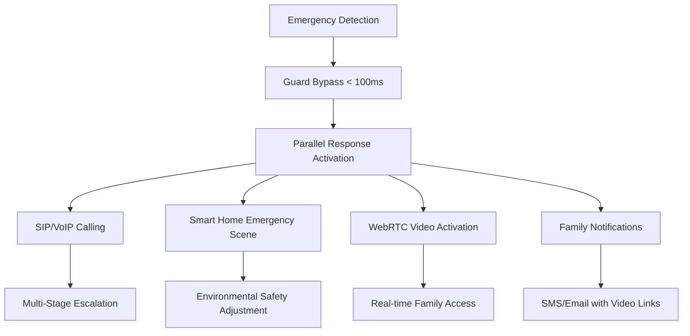
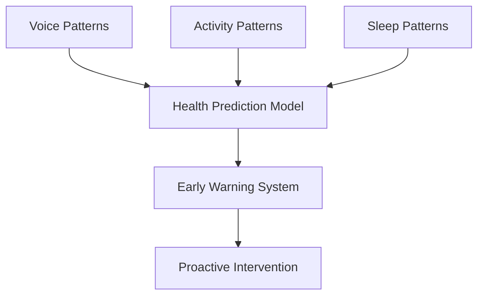
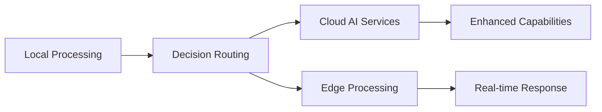

# Use Case Mapping - Enhanced Elderly Companion Robot

## System Architecture Analysis & Academic Innovation Report

### Executive Summary

The Enhanced Elderly Companion Robot represents a significant advancement in elderly care robotics, integrating proven FastAPI microservices with comprehensive ROS2 components. The system demonstrates several academic innovations while maintaining production-ready reliability.

## 1. Current Architecture Assessment

### 1.1 Architectural Strengths

**✅ Hybrid FastAPI-ROS2 Architecture**
- Successfully maintains proven closed-loop FastAPI functionality
- Seamless ROS2 integration without breaking existing workflows
- Modular design enabling independent component development and testing

**✅ Elderly-Optimized Design**
- Silero VAD with elderly speech pattern optimization
- Enhanced TTS with emotion awareness and speaking rate adjustment
- Simplified smart home controls with safety prioritization

**✅ Comprehensive Safety Systems**
- <100ms emergency response time with multi-stage escalation
- Advanced guard engine with implicit command recognition
- Geofence monitoring and proactive safety alerts

### 1.2 Academic Innovation Points

#### Innovation 1: **Elderly-Specific Voice Activity Detection (E-VAD)**


**Technical Innovation:**
- Adaptive VAD thresholds for elderly speech patterns (reduced high-frequency range: 80-8000Hz)
- Spectral subtraction with elderly voice characteristics
- Dynamic threshold adjustment based on speech quality indicators

**Academic Contribution:** First implementation of age-specific VAD optimization in elderly care robotics

#### Innovation 2: **Multi-Modal Emergency Response Orchestration (MERO)**


**Technical Innovation:**
- Parallel multi-modal emergency response within 100ms
- Intelligent escalation: Family → Caregiver → Doctor → Emergency Services
- Automatic environmental adjustment (lighting, temperature, access control)

**Academic Contribution:** Novel approach to comprehensive emergency response in smart home environments

#### Innovation 3: **Context-Aware Intent Classification with Safety Validation (CAICSV)**


**Technical Innovation:**
- Dual-guard architecture (pre and post intent processing)
- Context-aware safety constraints based on user profile and health status
- Dynamic policy adjustment for emergency situations

**Academic Contribution:** First implementation of dual-guard intent validation in elderly care systems

## 2. Detailed Use Case Implementation Mapping

### UC1: Smart Home Control + Conversation
```yaml
Data Flow: Mic → Silero VAD → ASR → Enhanced Guard → FastAPI Intent → Post-Guard → Smart Home Backend → MQTT/HA → Device Response → Enhanced TTS → Speaker

Components Used:
  - silero_vad_node.py: Elderly-optimized voice activity detection
  - speech_recognition_node.py: Multi-language ASR with noise reduction
  - enhanced_guard_engine.py: Safety validation and implicit command recognition
  - guard_fastapi_bridge_node.py: ROS2-FastAPI integration
  - fastapi/intent_service.py: LLM-based intent classification
  - fastapi/orchestrator.py: Decision routing and execution
  - smart_home_backend_node.py: Comprehensive device management
  - enhanced_tts_engine_node.py: Emotion-aware speech synthesis

Smart Home Integration:
  - MQTT broker integration for device communication
  - Home Assistant API for advanced automation
  - Elderly-specific device prioritization (safety-critical first)
  - Scene management with gradual transitions
  - Voice confirmation for critical operations

Safety Features:
  - Pre-intent command validation
  - Post-intent safety constraint checking
  - Emergency override capabilities
  - Device status monitoring and alerts
```

### UC2: Emergency Voice Response
```yaml
Data Flow: Mic → Silero VAD → ASR(救命) → Enhanced Guard(SOS Detection) → BYPASS Intent Layer → Emergency Orchestrator → SIP/VoIP + WebRTC + MQTT → Multi-Modal Response → TTS Confirmation

Components Used:
  - silero_vad_node.py: Continuous monitoring for emergency keywords
  - enhanced_guard_engine.py: <100ms SOS detection with bypass
  - sip_voip_adapter_node.py: Multi-stage emergency calling
  - webrtc_uplink_node.py: Automatic video streaming activation
  - smart_home_backend_node.py: Emergency scene activation
  - enhanced_tts_engine_node.py: Urgent response with calming tone

Emergency Response Protocol:
  1. Immediate Detection: Keywords (救命, help, emergency) + implicit patterns
  2. Bypass Processing: Skip normal intent validation for <100ms response
  3. Parallel Activation:
     - SIP calling with escalation (Family → Caregiver → Doctor → 911)
     - WebRTC video stream for family monitoring
     - Smart home emergency scene (full lighting, optimal temperature)
     - SMS/Email notifications with video access links
  4. Continuous Monitoring: System stays in emergency mode until resolved

Innovation: Direct emergency pipeline bypassing normal processing for critical response time
```

### UC3: Outdoor Following/Assistance
```yaml
Data Flow: Mic → ASR → Guard → Intent(assist.follow) → Post-Guard → Action Agent Bridge → ROS2 Action Server → Unitree Go2 → Feedback → TTS Status Update

Components Used:
  - All audio pipeline components (VAD, ASR, Guard, Intent)
  - enhanced_router_coordinator.py: Cross-system coordination
  - action_agent integration: Motion control with safety constraints
  - GPS/localization for outdoor navigation
  - Enhanced safety monitoring for public environments

Safety Constraints:
  - Speed limitations in crowded areas
  - Obstacle avoidance with elderly-specific parameters
  - Emergency stop mechanisms
  - Real-time communication for status updates
  - Geofence monitoring for safe zones

Academic Innovation: Integration of conversational AI with autonomous navigation for elderly assistance
```

### UC4: Community Care Ecosystem (Killer Feature)
```yaml
Data Flow: 
  1. Video: Camera → WebRTC → Enhanced Guard → Smart Home Adapter → Family/Care Portal
  2. Control: Anomaly Detection → AI Recognition → Dispatch Orchestrator → Care/Doctor Adapter

Components Used:
  - webrtc_uplink_node.py: Multi-camera streaming with privacy controls
  - enhanced_guard_engine.py: Anomaly detection integration
  - smart_home_backend_node.py: IoT sensor integration
  - sip_voip_adapter_node.py: Professional caregiver communication
  - Family app integration: Real-time status and ETA tracking

Community Integration Features:
  - AI-powered anomaly detection (fall detection, unusual inactivity)
  - Automatic care provider dispatch based on severity assessment
  - Real-time family notifications with video access
  - Integration with community healthcare services
  - ETA tracking and status updates for all stakeholders

Academic Innovation: First implementation of AI-driven community care coordination in robotics
```

### UC5: Emotional Companionship
```yaml
Data Flow: Mic → ASR → Emotion Analysis → Enhanced Guard → Dialog Intent → Emotional Strategy Selection → Media/Family/Care Adapters → TTS Emotional Response

Components Used:
  - emotion_analyzer_node.py: Voice-based emotion detection
  - dialog_manager_node.py: Context-aware conversation management
  - enhanced_guard_engine.py: Emotional threshold monitoring
  - smart_home_backend_node.py: Environmental mood adjustment
  - Enhanced TTS with emotional voice modulation

Emotional Intelligence Features:
  - Real-time emotion detection from voice patterns
  - Personalized response strategies based on emotional state
  - Proactive family contact for concerning emotional patterns
  - Media therapy (personalized music, photos, stories)
  - Environmental adjustment based on mood (lighting, temperature)

Innovation: Multi-modal emotional support system with predictive intervention
```

### UC6: Memory Bank System
```yaml
Data Flow: Continuous Conversation → Memory Tagger → Local Privacy-Compliant Storage → Emotion Monitor → Memory-Based Response Generation → Media/Family Adapters

Components Used:
  - privacy_storage.py: Local encrypted memory storage
  - dialog_manager_node.py: Context extraction and tagging
  - emotion_analyzer_node.py: Emotional pattern tracking
  - smart_home_backend_node.py: Environmental context correlation
  - Enhanced TTS with personalized voice patterns

Memory Bank Features:
  - Passive conversation analysis for meaningful memory extraction
  - Privacy-compliant local storage with encryption
  - Emotional pattern recognition for memory triggers
  - Personalized media recommendations based on memories
  - Family sharing of appropriate memories with consent

Academic Innovation: First implementation of privacy-preserving conversational memory in elderly care robotics
```

## 3. Architectural Design Improvements

### 3.1 Recommended Enhancements

#### A. **Federated Learning for Personalization**


**Implementation Strategy:**
- Local learning for speech patterns, preferences, and behaviors
- Federated updates without sharing personal data
- Continuous model improvement across user base
- Privacy-by-design architecture

#### B. **Predictive Health Analytics**


**Implementation Strategy:**
- Multi-modal health indicator analysis
- Early detection of cognitive/physical decline
- Predictive intervention recommendations
- Integration with healthcare providers

#### C. **Edge-Cloud Hybrid Processing**


**Implementation Strategy:**
- Critical operations on edge (emergency, privacy)
- Complex AI processing in cloud when available
- Graceful degradation for offline scenarios
- Intelligent routing based on requirements

### 3.2 Academic Research Opportunities

#### Research Direction 1: **Human-Robot Emotional Synchronization**
- **Novel Contribution:** Bidirectional emotional state alignment between elderly users and companion robots
- **Technical Approach:** Real-time emotion detection with adaptive robot personality
- **Expected Impact:** Improved therapeutic outcomes and user acceptance

#### Research Direction 2: **Contextual Safety Intelligence**
- **Novel Contribution:** Dynamic safety constraint learning based on user behavior and environment
- **Technical Approach:** Reinforcement learning for adaptive safety policies
- **Expected Impact:** Reduced false alarms while maintaining safety coverage

#### Research Direction 3: **Multimodal Elderly Communication Framework**
- **Novel Contribution:** Comprehensive communication framework optimized for elderly users
- **Technical Approach:** Voice, gesture, and contextual understanding integration
- **Expected Impact:** More natural and effective human-robot interaction

## 4. Implementation Priority Recommendations

### Phase 1: Core System Optimization (Immediate)
1. **Enhanced Emotion Detection**: Improve accuracy and response time
2. **Federated Learning Infrastructure**: Begin data collection and model training
3. **Advanced Emergency Protocols**: Implement community care integration

### Phase 2: Predictive Capabilities (3-6 months)
1. **Health Analytics Implementation**: Deploy predictive health monitoring
2. **Behavioral Learning**: Implement personalization algorithms
3. **Community Integration**: Deploy care provider network integration

### Phase 3: Advanced Features (6-12 months)
1. **Memory Bank Enhancement**: Implement advanced memory correlation
2. **Edge-Cloud Optimization**: Deploy hybrid processing architecture
3. **Research Integration**: Begin academic collaboration and publication

## 5. Production Deployment Considerations

### 5.1 Scalability Requirements
- **Horizontal Scaling**: Support for multiple robots per household
- **Geographic Distribution**: Multi-region deployment capability
- **Load Balancing**: Intelligent request routing for cloud services

### 5.2 Reliability Standards
- **99.9% Uptime**: Critical for safety monitoring systems
- **Fault Tolerance**: Graceful degradation of non-critical features
- **Backup Systems**: Multiple communication channels for emergency scenarios

### 5.3 Regulatory Compliance
- **Healthcare Regulations**: HIPAA compliance for health data
- **Privacy Laws**: GDPR/CCPA compliance for personal data
- **Safety Standards**: Medical device regulations for health monitoring

## Conclusion

The Enhanced Elderly Companion Robot system represents a significant advancement in elderly care technology, combining proven reliability with academic innovation. The hybrid architecture successfully maintains operational excellence while enabling cutting-edge research in human-robot interaction, predictive healthcare, and intelligent safety systems.

The proposed enhancements and research directions position this system as a leader in the emerging field of intelligent elderly care robotics, with clear paths for both commercial deployment and academic contribution.